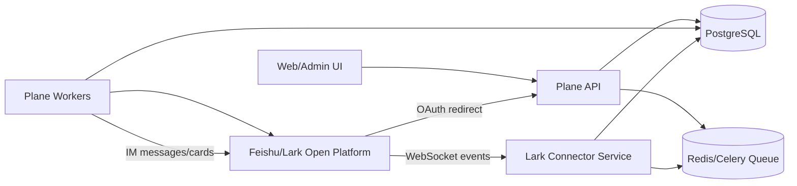

# Feishu/Lark Integration Technical Plan

## 背景

本方案用于在 Plane 中加入飞书/国际版 Lark 支持，目标是服务中国企业自托管场景：员工通过飞书 SSO 登录，管理员可以基于飞书通讯录管理成员，机器人通过飞书长连接接收事件，并将 Plane 任务事件推送到飞书。

本方案不包含品牌文案替换、产品命名调整、默认语言策略、中文翻译词条替换、Docker/pnpm 构建修复等非飞书能力。相关改动必须拆到独立 PR。

## 范围边界

本技术方案只覆盖飞书支持能力，任何实现 PR 都必须排除以下改动：

- 品牌文案变更，例如将 Plane 改名、替换产品名、修改用户可见品牌描述。
- i18n 策略变更，例如默认语言、浏览器语言检测、已有翻译词条大规模替换。
- 与飞书无关的构建、部署、CI 修复。
- 与飞书无关的 UI 文案润色。

飞书功能新增所需的少量 UI 文案可以随功能提交，但不得借机修改既有品牌、既有翻译或默认语言行为。

## 目标

- 支持 Feishu/Lark OAuth 登录。
- 使用飞书稳定身份绑定 Plane 用户，避免邮箱变更导致重复账号。
- 支持通讯录导入、增量同步和离职/冻结用户处理。
- 使用飞书长连接 WebSocket 接收机器人事件和通讯录事件。
- 使用飞书 IM API 发送任务通知卡片。
- 保持 Plane 主应用稳定，飞书故障不得阻断核心任务写入流程。
- 提供完整后台配置、健康检查、权限检查、同步状态和可观测性。

## 非目标

- 不把所有 workspace 成员默认加入每个项目。
- 不改变 Plane 的现有权限模型。
- 不把飞书邮箱作为不可变登录主键。
- 不在前端信任并透传飞书通讯录资料来创建用户。
- 不要求对外暴露 Webhook 回调 URL；机器人事件接收使用长连接。
- 不将机器人长连接逻辑运行在 Django web worker 中。

## 设计原则

1. 身份绑定优先使用飞书 `union_id`，无法获取时退到 `open_id`。
2. `email` 和 `enterprise_email` 是用户资料字段，不是身份主键。
3. 事件接收、事件处理、消息发送分层，避免长连接进程影响 API 主进程。
4. 所有外部事件必须幂等，使用飞书 `event_id` 去重。
5. 同步操作必须支持新增、更新、停用，而不是只新增。
6. 后台配置必须可验证，不能只依赖 env var。
7. 飞书能力必须 opt-in；未启用时对现有部署零影响。

## 目标架构



核心拆分：

- Plane API：负责 OAuth、配置、成员管理、内部同步 API、Outbox 写入。
- Lark Connector：独立进程，负责飞书 WebSocket 长连接、事件去重、事件入队。
- Celery worker：负责通讯录同步、Plane 事件转飞书通知、失败重试。
- Admin UI：负责配置 App ID/Secret、域名、权限检查、连接状态和手动同步。

## 模块划分

### 1. OAuth SSO

新增 OAuth provider：

- `LARK_CLIENT_ID`
- `LARK_CLIENT_SECRET`
- `LARK_BASE_DOMAIN`: `feishu.cn` 或 `larksuite.com`
- `IS_LARK_ENABLED`

授权入口：

- App: `/auth/lark/`
- App callback: `/auth/lark/callback/`
- Space: `/auth/spaces/lark/`
- Space callback: `/auth/spaces/lark/callback/`

OAuth 流程：

1. 生成 `state` 并写入 session。
2. 跳转到 `https://accounts.<domain>/open-apis/authen/v1/authorize`。
3. callback 校验 `state`。
4. 调用 `https://open.<domain>/open-apis/authen/v2/oauth/token` 换取 `user_access_token`。
5. 调用 `https://open.<domain>/open-apis/authen/v1/user_info` 获取用户信息。
6. 用 `union_id` 或 `open_id` 绑定 Plane 用户。

身份查找顺序：

1. `Account(provider="lark", provider_account_id=union_id)`。
2. `Account(provider="lark", provider_account_id=open_id)`。
3. 若存在可信邮箱且未被其他 Lark account 绑定，可按邮箱合并既有 Plane 用户。
4. 否则创建新用户，并创建 `Account`。

禁止只用 `User.email` 作为 OAuth 登录查找条件。飞书文档明确返回 `email` / `enterprise_email`，但这些字段依赖权限、管理员导入和租户配置，不能作为不可变身份。

### 2. 用户和账号模型

建议复用现有 `User` 和 `Account`，并扩展 `Account.metadata`：

```json
{
  "open_id": "ou_xxx",
  "union_id": "on_xxx",
  "tenant_key": "xxx",
  "user_id": "xxx",
  "email": "user@example.com",
  "enterprise_email": "user@company.com",
  "employee_no": "123",
  "lark_status": "active",
  "last_synced_at": "2026-05-29T00:00:00Z"
}
```

用户创建必须走统一 helper，例如 `sync_lark_user_identity(lark_user, source)`：

- 创建或更新 `User`。
- 创建或更新 `Profile`。
- 创建或更新 `Account(provider="lark")`。
- 设置 `display_name`、`first_name`、头像。
- 仅在确有邮箱时设置 `User.email` 为真实邮箱。
- 无邮箱时使用内部稳定占位邮箱，但占位邮箱不得作为长期身份判断依据。

占位邮箱建议格式：

```text
lark+<union_id>@internal.local
```

原因：

- 明确是系统内部占位。
- 避免 `<union_id>@lark.local` 被误认为真实可投递邮箱。
- 后续如果拿到真实邮箱，可以安全更新 `User.email`，身份仍由 `Account` 保持。

### 3. 通讯录同步

同步目标：

- 将飞书用户映射到 Plane 用户。
- 将目标飞书用户加入指定 workspace。
- 对离职、冻结、删除、移出授权范围用户执行停用策略。

同步策略：

- 全量同步：管理员手动触发、定时兜底。
- 增量同步：长连接接收通讯录事件后入队处理。
- 状态校准：定期按完整通讯录视图重新计算成员状态。

全量同步流程：

1. 获取 `tenant_access_token`。
2. 调用 `contact/v3/scopes`，必须处理 `has_more/page_token`。
3. 遍历授权范围内的部门和直属用户。
4. 部门 children 和 users 列表均必须处理分页。
5. 对每个用户调用 batch user API 或 user detail API 补齐字段。
6. 通过统一 helper 同步 `User` / `Account` / `WorkspaceMember`。
7. 标记本轮可见用户集合。
8. 对上轮可见、本轮不可见的成员执行配置化策略。

离职/冻结处理策略：

- `ignore`: 不处理，记录告警。
- `deactivate_workspace_member`: 停用 workspace membership。
- `deactivate_user`: 停用 Plane user。

默认建议：

```text
LARK_OFFBOARDING_POLICY=deactivate_workspace_member
```

权限边界：

- 查看通讯录、手动同步、批量导入只能允许 workspace admin 或 instance admin。
- 不能使用当前 `WorkSpaceAdminPermission`，因为它允许 Member。
- 手动同步传入的 role 必须校验不得高于请求者角色，且默认只能导入 Member。
- 前端只能提交 `union_id/open_id`，服务端必须重新查询飞书用户详情。

### 4. Lark Connector 长连接服务

新增独立服务，例如：

```text
apps/lark-connector/
```

职责：

- 使用飞书官方 SDK 建立 WebSocket 长连接。
- 订阅飞书事件。
- 解析事件。
- 用 `event_id` 去重。
- 将事件写入队列或调用内部同步服务。
- 暴露健康检查和指标。

建议事件：

```text
im.message.receive_v1
im.message.reaction.created_v1
im.message.reaction.deleted_v1
contact.user.created_v3
contact.user.updated_v3
contact.user.deleted_v3
contact.department.created_v3
contact.department.updated_v3
contact.department.deleted_v3
```

单实例约束：

- 同一个飞书应用只允许一个 active WebSocket consumer。
- 多实例部署时使用 Redis lock 或数据库 advisory lock。
- 未拿到 lock 的实例只暴露健康状态，不建立连接。

事件处理规范：

- 收到事件后快速 ACK。
- 不在 WebSocket 回调内执行数据库重同步或第三方 API 慢调用。
- 事件写入 `lark_events` 表或队列。
- worker 异步处理。
- 使用 `event_id` 唯一索引去重。

建议事件表：

```sql
CREATE TABLE lark_events (
  id uuid PRIMARY KEY,
  event_id varchar(255) UNIQUE NOT NULL,
  event_type varchar(255) NOT NULL,
  tenant_key varchar(255),
  payload jsonb NOT NULL,
  status varchar(32) NOT NULL DEFAULT 'pending',
  attempts integer NOT NULL DEFAULT 0,
  received_at timestamptz NOT NULL,
  processed_at timestamptz,
  last_error text
);
```

### 5. 飞书消息发送

长连接只负责接收事件。Plane 主动发消息仍走飞书 IM API：

```text
POST /open-apis/im/v1/messages?receive_id_type=union_id
```

发送触发：

- 任务分配。
- 状态变更。
- 评论。
- 提及。
- 到期提醒。

实现方式：

1. Plane 业务逻辑产生内部通知事件。
2. 写入 `lark_notification_outbox`。
3. Celery worker 发送飞书消息。
4. 失败重试，超过阈值进入 dead letter。

Outbox 表建议：

```sql
CREATE TABLE lark_notification_outbox (
  id uuid PRIMARY KEY,
  event_key varchar(255) UNIQUE NOT NULL,
  workspace_id uuid NOT NULL,
  recipient_user_id uuid NOT NULL,
  message_type varchar(64) NOT NULL,
  payload jsonb NOT NULL,
  status varchar(32) NOT NULL DEFAULT 'pending',
  attempts integer NOT NULL DEFAULT 0,
  next_retry_at timestamptz,
  sent_at timestamptz,
  last_error text,
  created_at timestamptz NOT NULL
);
```

发送前必须解析接收者：

1. 查 `Account(provider="lark")`。
2. 优先使用 `metadata.union_id`。
3. 退到 `provider_account_id`。
4. 无法解析则跳过并记录。

禁止写死 `PLANE_PUBLIC_BASE_URL`。必须从配置读取，缺失时后台配置页和 worker 启动都应告警。

### 6. 机器人交互能力

第一阶段只做通知，不做复杂命令。

可选第二阶段支持：

- 用户回复“创建任务 xxx”。
- 卡片按钮修改任务状态。
- 卡片按钮认领任务。
- `/plane search <keyword>` 搜索任务。

交互事件必须走同一个 Lark Connector：

- IM 文本事件进入命令解析队列。
- 卡片回调进入 action handler。
- 所有写 Plane 的动作通过内部 API 或 service 层执行，并校验用户身份和 workspace 权限。

### 7. 后台配置

Admin 需要新增完整页面：

```text
/authentication/lark
```

配置项：

- `IS_LARK_ENABLED`
- `LARK_CLIENT_ID`
- `LARK_CLIENT_SECRET`
- `LARK_BASE_DOMAIN`
- `LARK_DEFAULT_WORKSPACE_SLUG`
- `LARK_DEFAULT_WORKSPACE_ROLE`
- `LARK_AUTO_SYNC_ENABLED`
- `LARK_OFFBOARDING_POLICY`
- `LARK_NOTIFICATIONS_ENABLED`
- `LARK_CONNECTOR_ENABLED`
- `PLANE_PUBLIC_BASE_URL`

页面功能：

- 展示 OAuth callback URL。
- 保存 App ID / App Secret / 域名。
- 检查 tenant token 是否可用。
- 检查 OAuth user_info 是否可用。
- 检查通讯录 scope。
- 检查 IM 发送 scope。
- 展示长连接状态：connected / disconnected / no lock / reconnecting。
- 手动触发全量同步。
- 查看最近同步结果和错误。

### 8. API 设计

新增内部和管理 API：

```text
GET  /api/instances/lark/status/
POST /api/instances/lark/test-connection/
POST /api/instances/lark/test-message/

GET  /api/workspaces/:slug/lark/contacts/
POST /api/workspaces/:slug/lark/sync/
GET  /api/workspaces/:slug/lark/sync-runs/
POST /api/workspaces/:slug/lark/import/
```

权限：

- instance 级 API：instance admin。
- workspace lark API：workspace admin。
- connector 内部 API：service token 或直接写队列，不暴露公网。

请求安全：

- `import` 只接受 ID 列表，不接受 email/name 等用户资料。
- `sync` 默认异步返回 job id，不在 HTTP 请求中执行长耗时同步。
- 所有接口写审计日志。

### 9. 缓存与性能

- tenant token 缓存 90 分钟，真实 TTL 2 小时。
- 通讯录列表缓存 10 分钟，但 `sync` 使用 job cache，不直接依赖 modal cache。
- 大租户同步分页处理，每页入队或批量处理。
- 批量写数据库，避免每个用户多次查询。
- 手动同步接口返回 job id，前端轮询状态。

### 10. 可观测性

指标：

- `lark_connector_connected`
- `lark_connector_reconnect_total`
- `lark_events_received_total`
- `lark_events_processed_total`
- `lark_events_failed_total`
- `lark_sync_users_seen_total`
- `lark_sync_users_created_total`
- `lark_sync_members_deactivated_total`
- `lark_notifications_sent_total`
- `lark_notifications_failed_total`

日志必须包含：

- event_id
- event_type
- workspace_slug
- lark union_id/open_id 的脱敏值
- job_id
- retry_count

禁止记录：

- app secret
- tenant access token
- user access token
- refresh token

### 11. 数据迁移策略

如果已有 PR 9063 风格数据：

1. 扫描 `email LIKE '%@lark.local'` 的用户。
2. 从 email prefix 提取候选 union_id。
3. 创建或修复 `Account(provider="lark")`。
4. 若同一 union_id 同时存在真实邮箱用户和 synthetic 用户，执行合并计划。
5. 合并前生成报告，不自动删除用户。

迁移命令建议：

```text
python manage.py audit_lark_accounts
python manage.py repair_lark_accounts --dry-run
python manage.py repair_lark_accounts --apply
```

### 12. 测试计划

后端单元测试：

- OAuth token 成功。
- OAuth token 失败。
- user_info 缺 email 但有 union_id。
- user_info 后续新增 email 不创建第二个用户。
- 已有 email 用户绑定 Lark account。
- 通讯录 scopes 分页。
- 部门 children 分页。
- 用户列表分页。
- import 不信任前端 email。
- workspace member 无权拉通讯录。
- workspace member 无权同步 admin 角色。
- 离职策略停用 workspace member。
- Outbox 去重。
- `event_id` 去重。

集成测试：

- 管理员配置飞书 OAuth 后可登录。
- 手动同步创建用户、profile、account、workspace member。
- connector 收到通讯录事件后增量同步。
- Plane 任务分配产生飞书通知 outbox。
- worker 发送消息失败后重试。

前端测试：

- 后台配置页保存和校验状态。
- workspace admin 可以看到飞书导入入口。
- workspace member 看不到飞书导入入口。
- sync job 状态轮询。
- 错误状态展示。

### 13. PR 拆分建议

PR 1：飞书 OAuth 基础接入

- provider、routes、web/space 登录按钮。
- admin 配置页。
- instance config 初始化。
- `Account` 优先身份绑定。
- OAuth 测试。

PR 2：通讯录同步和导入

- 同步 service。
- workspace admin API。
- 全量同步 job。
- offboarding 策略。
- 前端导入页。
- 测试。

PR 3：Lark Connector 长连接

- 独立进程。
- WebSocket 事件接收。
- event store / queue。
- 健康检查。
- 去重和重试。
- 部署配置。

PR 4：飞书通知

- notification outbox。
- worker 发送 IM 卡片。
- 通知偏好。
- 失败重试。
- 卡片模板。

PR 5：机器人交互增强

- 文本命令。
- 卡片 action。
- 权限校验。
- 审计日志。

### 14. 对 PR 9063 的处理建议

可保留：

- OAuth provider 处理飞书 token endpoint JSON body 的方向。
- `LARK_BASE_DOMAIN` 支持 `feishu.cn` / `larksuite.com` 的方向。
- Web/Space 登录按钮方向。
- `is_lark_enabled` 暴露给前端的方向。

必须重做：

- 后台配置页和 instance config 初始化。
- 用户身份绑定逻辑。
- 通讯录同步权限和服务端校验。
- 用户创建流程。
- 通讯录分页。
- 离职/冻结处理。
- 飞书通知和机器人设计。

必须移除：

- 品牌文案变更。
- i18n 默认语言和词条变更。
- 写死部署域名。
- 项目自动加入逻辑。
- 前端传完整用户资料、后端直接信任的导入逻辑。

## 参考文档

- 飞书：获取 user_access_token：<https://open.feishu.cn/document/authentication-management/access-token/get-user-access-token>
- 飞书：获取用户信息：<https://open.feishu.cn/document/server-docs/authentication-management/login-state-management/get>
- 飞书：使用长连接接收事件：<https://open.feishu.cn/document/server-docs/event-subscription-guide/event-subscription-configure-/request-url-configuration-case?lang=zh-CN>
- 飞书：事件概述：<https://open.feishu.cn/document/server-docs/event-subscription-guide/overview?lang=zh-CN>
- 飞书：获取通讯录授权范围：<https://open.feishu.cn/document/uAjLw4CM/ukTMukTMukTM/reference/contact-v3/scope/list>
- 飞书：发送消息：<https://open.feishu.cn/document/server-docs/im-v1/message/create?lang=zh-CN>
