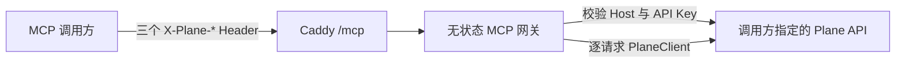

# Plane Remote MCP 部署设计

## 已实现结论

本项目可以随现有 `docker-compose.custom.yml` 直接部署 Remote MCP，公网入口为：

```text
https://<APP_DOMAIN>/mcp
```

实现采用无 OAuth、无状态、调用方逐请求配置的模式。部署端没有以下环境变量，也不会固定某个 Plane 实例或 Workspace：

- `PLANE_API_KEY`
- `PLANE_WORKSPACE_SLUG`
- `PLANE_API_HOST_URL`

这三个值属于 MCP 调用方。调用方通过三个 HTTP Header 把它们附加到每个 MCP 请求，网关验证后只为当前请求创建 Plane SDK Client。

## 请求协议

| 调用方配置             | MCP HTTP Header          | 用途                            |
| ---------------------- | ------------------------ | ------------------------------- |
| `PLANE_API_KEY`        | `X-Plane-Api-Key`        | 当前调用方的 Plane API Key      |
| `PLANE_WORKSPACE_SLUG` | `X-Plane-Workspace-Slug` | 当前工具调用所使用的 Workspace  |
| `PLANE_API_HOST_URL`   | `X-Plane-Api-Host-Url`   | 当前调用方要访问的 Plane 根地址 |

同一 MCP 服务可以并发服务不同 Host、Workspace 和 API Key；配置不会写入数据库、Redis、Compose 环境变量或 MCP 服务日志负载。

## 调用流程



网关基于官方 [`makeplane/plane-mcp-server`](https://github.com/makeplane/plane-mcp-server/tree/96cf4d51d65cfa5e47d10ff7a4a4caba3b7a98d1) `v0.2.11` 的工具注册和 `plane-sdk`，只替换了其固定 Base URL/Workspace 的认证及客户端上下文。上游依赖锁定到 commit `96cf4d51d65cfa5e47d10ff7a4a4caba3b7a98d1`。

## 安全边界

- MCP 入口没有 OAuth 授权、回调或 token storage 路由。
- API Key 会先请求调用方 Host 的 `/api/v1/users/me/` 进行验证。
- Host 必须是 HTTPS 根地址，不能包含 userinfo、路径、查询或 fragment。
- Host 的全部 DNS 结果必须是公网 IP；本机、私网、链路本地和保留地址均拒绝。
- API Key 不进入部署环境，也不记录 MCP 请求/响应 payload。
- `mcp` 容器不发布 8211 端口，只允许由现有 Caddy 转发 `/mcp`。

动态公网 Host 仍然意味着 MCP 服务拥有出站网络能力。生产网络层应继续限制容器访问云元数据地址和内部管理网段，作为 DNS rebinding 的纵深防御。

## 部署影响

现有部署只增加：

- `apps/mcp` Python 容器；
- `docker-compose.custom.yml` 中默认启动的 `mcp` service；
- Caddy 的 `/mcp` 和 `/mcp/*` 反向代理；
- 一个无需鉴权的 `/mcp/healthz` 存活检查。

不需要在 `.env.custom` 增加 Plane MCP 凭据或 OAuth 配置。完整构建、升级、验证和调用方示例见[自定义镜像 Docker Compose 升级手册](./custom-docker-compose-upgrade.md#remote-mcp)。

## 兼容范围

网关暴露上游版本注册的完整工具集合。最终可用工具取决于调用方指定的 Plane Host 所部署的 API 版本；较旧的自托管 Plane 若缺少某个上游 API，对应工具会返回 Plane API 的 404/校验错误，不影响其它兼容工具。
