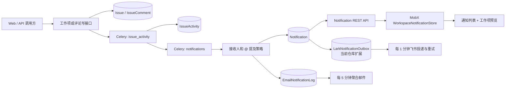
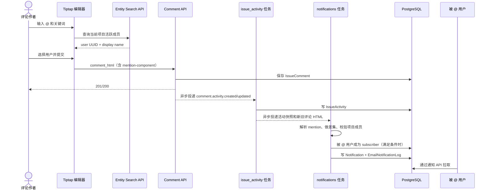
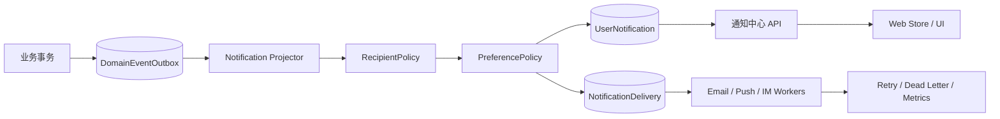

# Plane 通知中心与评论 @ 提及：实现、设计与可迁移架构

> 源码快照：分支 `aidong`，提交 `d87d70cfe28e70713192cbb4823d1cb2020eeaad`（2026-08-03）。
>
> 本文基于当前仓库源码，而不是产品宣传或二手资料。仓库包含本项目新增的飞书通知扩展；文中会把 Plane 核心链路和该扩展明确区分。

## 1. 结论先行

Plane 的通知实现不是一个单独的“发消息”模块，而是一条由多个领域对象串联的流水线：

1. 写接口完成工作项或评论变更。
2. Celery 任务把变更规范化为 `IssueActivity`。
3. 第二个 Celery 任务解析活动、计算接收人、识别新 @ 提及。
4. 为每个接收人写入一条 `Notification`，同时按偏好写入 `EmailNotificationLog`。
5. Web 通知中心通过 REST 拉取通知，MobX 维护列表、未读数和本地乐观状态。
6. 当前仓库还会把新建的 `Notification` 转成飞书 Outbox，定时重试投递。

核心源码入口分别是活动任务、通知任务、通知模型/API 和前端通知 Store：

- [活动归一化与异步衔接](../apps/api/plane/bgtasks/issue_activities_task.py#L1502-L1604)
- [接收人计算、@ 解析和通知创建](../apps/api/plane/bgtasks/notification_task.py#L36-L189)
- [通知数据模型](../apps/api/plane/db/models/notification.py#L13-L65)
- [通知 REST API](../apps/api/plane/app/views/notification/base.py#L33-L313)
- [前端通知中心 Store](../apps/web/core/store/notifications/workspace-notifications.store.ts#L33-L401)

这套实现最值得复用的设计是：**业务写入与通知分发异步解耦、服务端重新解析 @ 身份、接收人集合去重、站内通知与渠道投递分层、通知状态使用时间戳表达**。

不建议原样复制的部分是：**事件类型依赖自由字符串、接收人算法和渲染 payload 集中在一个大任务中、缺少通知幂等键、用 `sender` 字符串判断是否为 @ 通知、通知中心没有真正实时推送、部分批量筛选语义不一致**。如果是在新项目中实现，应该保留整体分层，但把事件、策略、Outbox 和幂等做成显式模块。

## 2. 概念边界

Plane 里有三个名字相近但职责不同的概念。

| 概念                  | 作用                                                               | 主要表/代码                                                                                                |
| --------------------- | ------------------------------------------------------------------ | ---------------------------------------------------------------------------------------------------------- |
| 工作项活动 Activity   | 记录“谁对什么字段做了什么”，用于历史时间线，也是通知生成的事实输入 | `IssueActivity`，[模型](../apps/api/plane/db/models/issue.py#L465-L498)                                    |
| 用户通知 Notification | 面向某一个接收人的可读、可归档、可稍后提醒记录                     | `Notification`，[模型](../apps/api/plane/db/models/notification.py#L13-L65)                                |
| Intake/Inbox 工作项   | 项目接收箱中的待受理工作项，是业务实体状态，不是通知               | 通知 API 通过子查询计算 `is_inbox_issue`，[查询](../apps/api/plane/app/views/notification/base.py#L58-L78) |

前端页面虽然在导航上显示为 Inbox，但路由是 `/{workspaceSlug}/notifications/`。通知详情根据 `is_inbox_issue` 决定打开 Intake 详情还是普通工作项 Peek 详情；因此“通知中心 Inbox”和“项目 Intake Inbox”不能共用一个领域模型。[页面布局](<../apps/web/app/(all)/[workspaceSlug]/(projects)/notifications/layout.tsx#L7-L19>) [详情分流](../apps/web/core/components/workspace-notifications/root.tsx#L85-L114)

## 3. 总体架构



这不是 Django signal 驱动的通用事件总线。各业务写接口显式调用 `issue_activity.delay(...)`，并通过 `notification=True` 决定是否继续生成通知。例如内部评论创建和更新都会显式开启通知；工作项的 Web API 与外部 v1 工作项 API 也采用同一约定。[评论写接口](../apps/api/plane/app/views/issue/comment.py#L63-L141) [工作项写接口](../apps/api/plane/app/views/issue/base.py#L409-L436) [外部 API 合同测试](../apps/api/plane/tests/contract/api/test_issue_notifications.py#L66-L135)

Celery 的 Broker 是 RabbitMQ/AMQP，Redis 主要用于邮件锁和保存通知跳转所需的请求 origin；因此部署这条链路时，API、Celery Worker、RabbitMQ、Redis 和 PostgreSQL 都是相关运行依赖。[Celery Broker 配置](../apps/api/plane/settings/common.py#L318-L330) [邮件 Redis 锁](../apps/api/plane/bgtasks/email_notification_task.py#L33-L43)

### 3.1 模块职责

| 层           | 职责                                                 | 关键文件                                                                                                                                                                   |
| ------------ | ---------------------------------------------------- | -------------------------------------------------------------------------------------------------------------------------------------------------------------------------- |
| 富文本编辑器 | 搜索 @ 候选、插入结构化 mention 节点、渲染用户卡片   | [mention 扩展](../packages/editor/src/core/extensions/mentions/extension-config.ts#L23-L70)、[候选查询 Hook](../apps/web/core/hooks/editor/use-editor-mention.tsx#L30-L90) |
| 业务 API     | 保存评论/工作项，投递活动任务                        | [评论 ViewSet](../apps/api/plane/app/views/issue/comment.py#L28-L160)、[工作项 ViewSet](../apps/api/plane/app/views/issue/base.py#L633-L719)                               |
| 活动层       | 将输入差异转换成统一的 `IssueActivity`               | [活动 Mapper](../apps/api/plane/bgtasks/issue_activities_task.py#L1540-L1588)                                                                                              |
| 通知策略层   | 解析 mention、计算订阅者、应用偏好、构建通知 payload | [通知任务](../apps/api/plane/bgtasks/notification_task.py#L192-L674)                                                                                                       |
| 持久化/API   | 保存每用户通知并提供列表、未读、归档、稍后提醒接口   | [模型](../apps/api/plane/db/models/notification.py#L13-L65)、[ViewSet](../apps/api/plane/app/views/notification/base.py#L33-L293)                                          |
| Web 状态/UI  | 游标分页、筛选、未读计数、乐观更新、详情预览         | [Store](../apps/web/core/store/notifications/workspace-notifications.store.ts#L63-L401)、[通知实例](../apps/web/core/store/notifications/notification.ts#L33-L324)         |
| 渠道         | 邮件聚合发送；当前 fork 另有飞书 Outbox              | [邮件任务](../apps/api/plane/bgtasks/email_notification_task.py#L46-L84)、[飞书入队](../apps/api/plane/integrations/lark/notifications.py#L310-L358)                       |

## 4. 数据模型

### 4.1 `Notification`：一条记录只属于一个接收人

`Notification` 是通知中心的核心读模型。它不是领域事件本身，而是事件经过接收人策略和展示投影后形成的“每用户副本”。主要字段如下。[源码](../apps/api/plane/db/models/notification.py#L13-L65)

| 字段                               | 含义                                               | 设计作用                                              |
| ---------------------------------- | -------------------------------------------------- | ----------------------------------------------------- |
| `workspace`, `project`             | 租户和项目范围                                     | 查询隔离、跳转上下文                                  |
| `receiver`                         | 接收人                                             | 一条通知只服务一个用户                                |
| `triggered_by`                     | 触发人                                             | 头像、姓名、审计                                      |
| `entity_name`, `entity_identifier` | 关联实体类型和 UUID                                | 目前通知列表实际只读取 `issue`                        |
| `sender`                           | 来源字符串，如 `in_app:issue_activities:mentioned` | 同时被用于 created/assigned/subscribed/mentioned 分类 |
| `title`, `message*`                | 展示文本                                           | 兼容文本、HTML、JSON 等形态                           |
| `data`                             | 展示快照 JSON                                      | 包含工作项快照和活动快照，避免列表渲染再次联表        |
| `read_at`                          | 已读时间                                           | `NULL` 即未读                                         |
| `archived_at`                      | 归档时间                                           | `NULL` 即未归档                                       |
| `snoozed_till`                     | 稍后提醒截止时间                                   | 用于默认列表和 Snoozed 列表筛选                       |

数据库索引围绕 `receiver + workspace + 状态 + created_at`、接收人和实体、接收人和 sender 等访问模式建立，说明这个模型优先服务“某用户在某工作区的通知时间线”，而不是全局事件分析。[索引](../apps/api/plane/db/models/notification.py#L35-L65)

典型 `data` 结构如下；前后端类型也固定围绕 `issue` 和 `issue_activity` 两段读取。[后端构建](../apps/api/plane/bgtasks/notification_task.py#L365-L407) [前端类型](../packages/types/src/workspace-notifications.ts#L20-L67)

```json
{
  "issue": {
    "id": "issue-uuid",
    "name": "修复登录错误",
    "identifier": "WEB",
    "sequence_id": 123,
    "state_name": "进行中",
    "state_group": "started"
  },
  "issue_activity": {
    "id": "activity-uuid",
    "verb": "created",
    "field": "comment",
    "actor": "user-uuid",
    "new_value": "<p>请 <mention-component ...></mention-component> 看一下</p>",
    "old_value": "",
    "issue_comment": "请 @张三 看一下",
    "old_identifier": null,
    "new_identifier": "comment-uuid"
  }
}
```

### 4.2 支撑模型

| 模型                         | 职责                      | 关键事实                                                                                                                                         |
| ---------------------------- | ------------------------- | ------------------------------------------------------------------------------------------------------------------------------------------------ |
| `IssueActivity`              | 统一活动事实              | 保存 `verb/field/old_value/new_value/comment/actor`，评论活动通过外键关联 `IssueComment`；[源码](../apps/api/plane/db/models/issue.py#L465-L498) |
| `IssueComment`               | 评论正文                  | 同时保存 `comment_html/comment_json/comment_stripped`；保存时从 HTML 生成纯文本；[源码](../apps/api/plane/db/models/issue.py#L501-L590)          |
| `IssueMention`               | 工作项描述中的当前 @ 关系 | 对 `issue + mention` 做活动记录唯一约束；评论 mention 当前没有对应持久化表；[源码](../apps/api/plane/db/models/issue.py#L373-L392)               |
| `IssueSubscriber`            | 工作项订阅者              | 分配、主动操作和 @ 都可能把用户加入订阅集合；[源码](../apps/api/plane/db/models/issue.py#L624-L647)                                              |
| `UserNotificationPreference` | 邮件偏好                  | `property_change/state_change/comment/mention/issue_completed` 五个布尔项；[源码](../apps/api/plane/db/models/notification.py#L81-L118)          |
| `EmailNotificationLog`       | 待聚合的邮件投递日志      | 保存接收人、触发人、实体和活动 payload，并记录 `processed_at/sent_at`；[源码](../apps/api/plane/db/models/notification.py#L121-L149)             |

新用户创建时，非 Bot 用户会自动创建一份全部开启的通知偏好；历史用户由迁移补齐。[用户 post-save](../apps/api/plane/db/models/user.py#L299-L313) [数据迁移](../apps/api/plane/db/migrations/0057_auto_20240122_0901.py#L6-L24)

### 4.3 当前 fork 的飞书 Outbox

飞书不是 Plane 核心通知模型的一部分，而是当前仓库在 `Notification` 之后增加的渠道投递层。`LarkNotificationOutbox` 有唯一的 `event_key`、状态机、尝试次数、下次重试时间和错误信息；这比邮件日志更接近标准 Transactional Outbox。[模型](../apps/api/plane/db/models/lark.py#L116-L155)

```text
pending -> sending -> sent
                   -> failed -> sending ... -> dead
                   -> skipped（接收人没有绑定飞书账号）
```

新 `Notification` 批量写入后，任务用 `notification:{notification.id}:lark` 作为幂等事件键生成 Outbox；定时任务通过行锁认领，失败时指数退避，最多尝试 5 次。[入队](../apps/api/plane/integrations/lark/notifications.py#L310-L358) [投递](../apps/api/plane/bgtasks/lark_task.py#L204-L275)

## 5. 从业务变更到通知的完整链路

### 5.1 第一步：业务接口保存实体

评论创建接口先用 `IssueCommentSerializer` 校验并保存评论，然后异步调用：

```python
issue_activity.delay(
    type="comment.activity.created",
    requested_data=...,
    actor_id=...,
    issue_id=...,
    project_id=...,
    current_instance=None,
    notification=True,
)
```

评论更新把更新前的完整序列化结果放在 `current_instance`，把请求内容放在 `requested_data`，这样下游可以计算“本次新增加的 @”，而不是给评论里所有人重复发通知。[创建/更新接口](../apps/api/plane/app/views/issue/comment.py#L63-L141)

评论 HTML 仍会在服务端通过 `validate_html_content` 校验和清洗；不能把富文本节点当成可信客户端声明。[序列化校验](../apps/api/plane/app/serializers/issue.py#L698-L726)

HTML 清洗器显式允许 `mention-component`，但只保留 `id/entity_identifier/entity_name` 三个 mention 属性，脚本或其他任意属性不会随评论进入持久化内容。[清洗白名单](../apps/api/plane/utils/content_validator.py#L71-L79) [mention 属性](../apps/api/plane/utils/content_validator.py#L114-L136)

### 5.2 第二步：活动归一化

`issue_activity` 根据字符串事件类型选择 Mapper。工作项字段更新、评论创建/更新/删除、附件、链接、关系、Reaction 等都先转换为 `IssueActivity`；批量落库之后，只有 `notification=True` 才继续投递 `notifications.delay(...)`。[Mapper 和衔接](../apps/api/plane/bgtasks/issue_activities_task.py#L1502-L1604)

评论活动的归一化结果为：

| 场景     | `verb`    | `field`   | `old_value`       | `new_value`       |
| -------- | --------- | --------- | ----------------- | ----------------- |
| 创建评论 | `created` | `comment` | 空                | 新 `comment_html` |
| 编辑评论 | `updated` | `comment` | 旧 `comment_html` | 新 `comment_html` |
| 删除评论 | `deleted` | `comment` | -                 | -                 |

对应代码见 [评论活动构建](../apps/api/plane/bgtasks/issue_activities_task.py#L666-L752)。

### 5.3 第三步：解析接收人

通知任务先取得所有活跃项目成员，然后计算：

- `new_mentions`：工作项新描述中的用户集合减去旧描述中的集合。
- `removed_mention`：旧描述集合减去新描述集合。
- `comment_mentions`：本次评论新 HTML 中的用户集合减去旧 HTML 中的集合。
- `issue_subscribers`：活跃项目成员中的订阅者，排除触发人、新描述 mention 和新评论 mention。
- `issue_assignees`：活跃项目成员中的负责人。

只有活跃项目成员能成为最终 mention 接收人；即使攻击者手工构造其他用户 UUID，后端与项目成员集合的交集也会将其排除。[集合计算](../apps/api/plane/bgtasks/notification_task.py#L232-L311)

普通订阅通知的分类规则是：

1. 工作项创建人收到 `in_app:issue_activities:created`。
2. 当前负责人收到 `in_app:issue_activities:assigned`。
3. 其他订阅者收到 `in_app:issue_activities:subscribed`。

触发人不会收到自己操作产生的通知，新 mention 用户也不会同时再收到一条普通订阅通知，避免同一次操作重复提醒。[接收人与 sender 分类](../apps/api/plane/bgtasks/notification_task.py#L281-L320)

当任务参数 `subscriber=True`（默认值）时，执行本次活动的 actor 也会被加入工作项订阅者；这是 Plane 扩大后续通知范围的另一项产品策略。[actor 自动订阅](../apps/api/plane/bgtasks/notification_task.py#L292-L301)

### 5.4 第四步：生成每用户通知和渠道日志

对每个普通订阅者，任务会为本次每条有效 `IssueActivity` 创建一条 `Notification`。一般的描述更新不会发普通通知；描述中的新 @ 走单独的 mention 分支。[普通通知构建](../apps/api/plane/bgtasks/notification_task.py#L321-L453)

邮件是否写入 `EmailNotificationLog` 由接收人的五项偏好决定，但这些偏好只影响邮件日志，不阻止站内 `Notification` 创建。因此“关闭评论邮件”不等于“关闭站内评论通知”。[偏好判断](../apps/api/plane/bgtasks/notification_task.py#L321-L351)

同样，这五项偏好也不会阻止当前 fork 创建飞书 Outbox；现有飞书开关是实例级配置，而不是每用户、每事件偏好。[飞书入队开关](../apps/api/plane/integrations/lark/notifications.py#L310-L323)

最后通过 `bulk_create` 写入站内通知和邮件日志；当前 fork 随后把已创建通知加入飞书 Outbox。[批量落库](../apps/api/plane/bgtasks/notification_task.py#L663-L673)

## 6. 评论 @ 提及的端到端实现

### 6.1 编辑器如何表示 @

前端使用 Tiptap Mention 扩展。输入 `@` 后，前端调用 workspace entity-search API 搜索候选；候选项携带用户 UUID、展示名和 `entity_name="user_mention"`。[候选查询](../apps/web/core/hooks/editor/use-editor-mention.tsx#L37-L79) [服务请求](../apps/web/core/services/workspace.service.ts#L330-L341)

候选查询不是任意用户搜索。服务端只返回当前工作区或当前项目中的活跃成员，并排除 Bot；本 fork 还支持中文名拼音和首字母匹配。[服务端成员范围](../apps/api/plane/app/views/search/base.py#L364-L418) [拼音匹配](../apps/api/plane/app/views/search/base.py#L50-L102)

选中候选后，编辑器生成一个独立的 transaction UUID 作为节点 `id`，实体用户 UUID 放在 `entity_identifier` 中。[下拉选择](../packages/editor/src/core/extensions/mentions/mentions-list-dropdown.tsx#L25-L53)

最终 HTML 结构类似：

```html
<p>
  请
  <mention-component
    id="mention-node-uuid"
    entity_identifier="user-uuid"
    entity_name="user_mention"
  ></mention-component>
  看一下这个问题
</p>
```

扩展明确声明只解析和输出 `mention-component`，并持久化 `id/entity_identifier/entity_name` 三个属性。[节点序列化](../packages/editor/src/core/extensions/mentions/extension-config.ts#L23-L48) [属性定义](../packages/editor/src/core/extensions/mentions/types.ts#L10-L20)

评论表单把编辑器的 `comment_html` 直接作为评论 payload 提交。它没有单独上传 `mentioned_user_ids`，因此服务端 HTML 是 @ 事实的唯一来源。[评论表单](../apps/web/core/components/comments/comment-create.tsx#L52-L88) [评论 Service](../apps/web/core/services/issue/issue_comment.service.ts#L48-L61)

### 6.2 服务端如何识别“新 @”

服务端使用 BeautifulSoup 查找同时满足以下条件的标签：

```text
tag = mention-component
entity_name = user_mention
user_id = entity_identifier
```

解析结果先去重。评论创建时所有 mention 都是新的；评论编辑时用新旧 HTML 中的用户集合做差集，只给新增用户发送 mention 通知。[解析与差集](../apps/api/plane/bgtasks/notification_task.py#L134-L156)

这带来三个明确语义：

- 同一条评论里 @ 同一个人多次，只生成一组 mention 接收关系。
- 编辑文字但保留原 @，不会重复提醒原用户。
- 删除后再次添加同一个 @，会被识别为本次新增，重新提醒。

### 6.3 @ 提及时序



### 6.4 @ 之后为什么会自动订阅

Plane 会尝试把描述中和评论中被 @ 的用户加入 `IssueSubscriber`。只有用户当前不是订阅者、负责人或创建人，并且仍是活跃项目成员时才新增订阅。[订阅判定](../apps/api/plane/bgtasks/notification_task.py#L85-L113)

这意味着一次 @ 不只是一次性提醒，还可能改变后续通知范围：被 @ 用户随后会收到该工作项的普通活动通知。这个是产品策略，不是实现 @ 的技术必需条件；迁移到其他项目时必须明确是否需要这种“@ 即关注”语义。

工作项描述的 mention 还会同步到 `IssueMention` 表，便于按“描述里提到过我”查询；评论 mention 目前只在代码中留有 TODO，并未建立等价的持久化关系。[描述 mention 同步](../apps/api/plane/bgtasks/notification_task.py#L39-L52) [评论 mention TODO](../apps/api/plane/bgtasks/notification_task.py#L251-L270)

## 7. “其他通知”如何产生

### 7.1 活动类型

活动任务支持工作项创建/更新/删除、评论、周期、模块、链接、附件、工作项关系、Reaction、Vote、草稿和 Intake 等事件。并不是所有活动都生成通知：通知任务显式排除了 cycle/module、reaction、vote、draft 等类型。[活动类型表](../apps/api/plane/bgtasks/issue_activities_task.py#L1540-L1568) [通知排除表](../apps/api/plane/bgtasks/notification_task.py#L203-L221)

当前真正进入通知中心的主干是：

| 事件                 | 通知接收人                         | 说明                              |
| -------------------- | ---------------------------------- | --------------------------------- |
| 工作项属性变化       | 创建人、负责人、其他订阅者         | 触发人排除；普通描述更新排除      |
| 新建/编辑/删除评论   | 订阅者；新增 @ 用户走 mention 分支 | 新 @ 用户不会重复收到普通订阅通知 |
| 新增负责人           | 负责人会被自动加入订阅             | 由活动追踪逻辑创建订阅关系        |
| 描述新增 @           | 新 @ 用户                          | 同步 `IssueMention`               |
| 评论新增 @           | 新 @ 用户                          | 当前不持久化评论 mention 关系     |
| 链接/附件/关系等活动 | 订阅者                             | 经过 `IssueActivity` 统一展示     |

新增负责人自动订阅的逻辑位于 [assignee 活动追踪](../apps/api/plane/bgtasks/issue_activities_task.py#L356-L430)。

### 7.2 展示文案不是后端完整字符串

后端通知主要保存活动结构，前端再按 `field + verb + old_value + new_value` 生成文案。例如 `assignees` 显示 added/removed assignee，`comment` 显示 commented，`target_date` 显示 set/removed due date；未知字段走通用 fallback。[前端文案映射](../apps/web/core/components/workspace-notifications/sidebar/notification-card/content.tsx#L45-L147) [fallback](../apps/web/core/components/workspace-notifications/notification-card/content.ts#L10-L31)

这个设计允许同一通知 payload 在 Web、邮件、飞书中分别渲染，但也意味着 `field/verb` 实际上已经成为跨端协议，修改字段名需要同步所有渲染器。

## 8. 通知 REST API

路由集中在 [notification.py](../apps/api/plane/app/urls/notification.py#L16-L51)。所有 workspace 通知查询都把 `receiver` 固定为当前登录用户，防止读取或修改其他人的通知。[QuerySet 隔离](../apps/api/plane/app/views/notification/base.py#L37-L46)

| 方法               | 路径                                               | 作用                            |
| ------------------ | -------------------------------------------------- | ------------------------------- |
| `GET`              | `/api/workspaces/{slug}/users/notifications/`      | 游标分页列表和筛选              |
| `GET/PATCH/DELETE` | `/api/workspaces/{slug}/users/notifications/{id}/` | 详情、更新 `snoozed_till`、删除 |
| `POST/DELETE`      | `.../{id}/read/`                                   | 标为已读/未读                   |
| `POST/DELETE`      | `.../{id}/archive/`                                | 归档/取消归档                   |
| `GET`              | `.../unread/`                                      | 普通和 mention 未读计数         |
| `POST`             | `.../mark-all-read/`                               | 按部分筛选条件批量已读          |
| `GET/PATCH`        | `/api/users/me/notification-preferences/`          | 获取/更新邮件偏好               |

列表支持：

- `mentioned=true`：只查 sender 包含 `mentioned` 的通知；缺省时反而排除 mention。
- `type=created,assigned,subscribed`：按工作项与当前用户的创建/负责人/订阅关系过滤。
- `read=true|false`：已读或未读。
- `archived=true|false`：归档状态。
- `snoozed=true|false`：稍后提醒状态。
- `per_page + cursor`：游标分页。

具体查询逻辑见 [列表过滤](../apps/api/plane/app/views/notification/base.py#L49-L154)。未读接口分别返回普通和 mention 两个计数，普通计数明确排除 mention，因此它不是包含 mention 的总数。[未读计数](../apps/api/plane/app/views/notification/base.py#L201-L234)

## 9. 前端通知中心

### 9.1 页面和组件结构

```text
notifications/layout.tsx
├── NotificationsSidebarRoot
│   ├── Header
│   │   ├── 全部标为已读
│   │   ├── 手动刷新
│   │   ├── created / assigned / subscribed 筛选
│   │   └── 未读 / 已归档 / 已稍后提醒筛选
│   ├── All / Mentions Tab + 各自未读数
│   └── NotificationItem 列表 + Load more
└── NotificationsRoot
    ├── 未选中：空状态
    ├── Intake 工作项：InboxContentRoot
    └── 普通工作项：IssuePeekOverview
```

来源：[布局](<../apps/web/app/(all)/[workspaceSlug]/(projects)/notifications/layout.tsx#L7-L19>)、[侧边栏](../apps/web/core/components/workspace-notifications/sidebar/root.tsx#L28-L122)、[详情](../apps/web/core/components/workspace-notifications/root.tsx#L29-L118)。

### 9.2 MobX 状态设计

`WorkspaceNotificationStore` 保存全局列表状态：

- `notifications: Record<notificationId, Notification>`：规范化实体 Map。
- `currentNotificationTab`：`all` 或 `mentions`。
- `currentSelectedNotificationId`：当前详情。
- `unreadNotificationsCount`：普通与 mention 两个计数。
- `paginationInfo`：游标和是否还有下一页。
- `filters`：type、read、archived、snoozed。

每条记录被包装为 `Notification` MobX 实例，实例自己负责已读、归档、稍后提醒等操作和乐观更新；列表 Store 负责查询、合并、筛选、计数和批量已读。[列表 Store](../apps/web/core/store/notifications/workspace-notifications.store.ts#L33-L110) [实体 Store](../apps/web/core/store/notifications/notification.ts#L19-L122)

这种“列表 Store + 实体 Store”拆分适合通知中心：单条操作不会刷新整个列表，详情和列表也能共享同一对象。

### 9.3 拉取、分页和筛选

列表首次进入时通过 SWR 调用 `getNotifications`，后者先拉未读数，再拉分页数据。当前每页固定请求 300 条；下一页需要用户点击 Load more。[首次加载](../apps/web/core/components/workspace-notifications/root.tsx#L45-L62) [请求与合并](../apps/web/core/store/notifications/workspace-notifications.store.ts#L337-L363) [Load more](../apps/web/core/components/workspace-notifications/notification-card/root.tsx#L21-L60)

切换 Tab 或筛选时，Store 会清空当前 Map 并重新请求。`Mentions` Tab 发送 `mentioned=true`；所谓 `All` Tab 实际只显示非 mention 通知，因为后端缺省分支会排除 mention，前端本地计算也把 mention 排除。[查询参数](../apps/web/core/store/notifications/workspace-notifications.store.ts#L180-L210) [本地列表选择](../apps/web/core/store/notifications/workspace-notifications.store.ts#L119-L155)

顶部导航和应用侧栏还有一项产品优先级规则：只要 mention 未读数大于 0，红点/数字优先展示 mention 数；否则才展示普通未读数。它不是两个计数的加总。[顶部导航](../apps/web/core/components/navigation/top-navigation-root.tsx#L35-L45) [侧栏计数](../apps/web/core/components/workspace-notifications/notification-app-sidebar-option.tsx#L27-L43)

### 9.4 已读、归档和稍后提醒

点击通知会先设为当前详情；若未读则调用 read API，并打开 Intake 或普通工作项预览。[点击行为](../apps/web/core/components/workspace-notifications/sidebar/notification-card/item.tsx#L27-L69)

单条已读/未读、归档/取消归档、snooze/unsnooze 都先修改 MobX 对象，再请求服务端；请求失败则恢复旧值。已读操作还会本地增减对应 Tab 的计数。[乐观状态](../apps/web/core/store/notifications/notification.ts#L189-L324)

Snooze 支持 1/3/5 天、1/2 周和自定义日期；它复用通知 PATCH 接口更新 `snoozed_till`。[选项常量](../packages/constants/src/notification.ts#L65-L111)

### 9.5 实时性

当前通知中心没有专用 WebSocket、SSE 或推送订阅。通知列表在页面挂载、用户手动刷新、切换筛选时获取；未读数通过 SWR 在导航组件挂载或重新聚焦时刷新。Web 使用的 SWR 配置开启 `revalidateOnFocus`，但没有固定轮询间隔。[导航计数](../apps/web/core/components/navigation/top-navigation-root.tsx#L24-L46) [SWR 配置](../packages/constants/src/swr.ts#L16-L22)

因此它是“最终一致的拉取式通知中心”，不是秒级实时通知系统。如果另一个项目要求浏览器立刻出现红点，应增加 WebSocket/SSE 或至少短轮询，并继续以 REST 列表作为断线恢复的事实来源。

## 10. 邮件与飞书渠道

### 10.1 邮件

邮件不是每条活动立即发送。通知任务先写 `EmailNotificationLog`，Celery Beat 每 5 分钟执行一次 `stack_email_notification`，按接收人、工作项和触发人聚合，再异步发送一封摘要邮件。[聚合任务](../apps/api/plane/bgtasks/email_notification_task.py#L46-L84) [调度周期](../apps/api/plane/celery.py#L44-L49)

邮件渲染会把 `mention-component` 转回 `@展示名`，并把同一工作项的评论、mention 和属性变化组织到模板中。[mention 转换](../apps/api/plane/bgtasks/email_notification_task.py#L130-L149) [邮件构建](../apps/api/plane/bgtasks/email_notification_task.py#L152-L287)

用户设置页的五个开关直接 PATCH 全局用户通知偏好；当前 UI 和 API 没有暴露模型中预留的 workspace/project 级覆盖。[设置 UI](../apps/web/core/components/settings/profile/content/pages/notifications/email-notification-form.tsx#L27-L165) [偏好 API](../apps/api/plane/app/views/notification/base.py#L296-L313)

模型也没有对 `user` 建唯一约束，而业务读取统一使用 `.get(user=...)`。当前依赖用户创建 signal 和历史迁移维持“一人一条”；若未来启用 scope 级偏好，必须先定义唯一键和优先级合并规则。[偏好模型](../apps/api/plane/db/models/notification.py#L81-L118) [偏好读取](../apps/api/plane/app/views/notification/base.py#L296-L313)

### 10.2 飞书（当前仓库扩展）

当前 fork 在站内通知落库后生成飞书 Outbox。渠道适配器会把通用活动 payload 转成中文结构化卡片，并给未知字段保留 fallback；接收人没有绑定飞书账号时记录为 `skipped`。[卡片投影](../apps/api/plane/integrations/lark/notifications.py#L169-L295) [Outbox 入队](../apps/api/plane/integrations/lark/notifications.py#L310-L358)

Celery Beat 每分钟处理待发送和到期重试的 Outbox。该实现展示了比“在业务事务里直接调第三方 API”更稳健的渠道扩展方式。[调度](../apps/api/plane/celery.py#L54-L60) [投递状态机](../apps/api/plane/bgtasks/lark_task.py#L204-L275)

## 11. 当前实现的设计优点

### 11.1 服务端对 @ 再校验

前端候选搜索只是一层体验优化；服务端仍解析 HTML、去重、与活跃项目成员求交集，并排除触发人。这能抵御伪造 `entity_identifier` 和过期成员关系。[解析](../apps/api/plane/bgtasks/notification_task.py#L134-L156) [成员过滤](../apps/api/plane/bgtasks/notification_task.py#L232-L267)

### 11.2 活动事实与用户通知分离

一个 `IssueActivity` 可以投影成多条用户 `Notification`，并继续投影成邮件或飞书。这比直接把“给张三发消息”写进业务接口更容易扩展和审计。[活动到通知衔接](../apps/api/plane/bgtasks/issue_activities_task.py#L1583-L1599)

### 11.3 状态时间戳比布尔值信息更多

`read_at/archived_at/snoozed_till` 既能表达状态，也保留状态发生时间，便于排序、分析和以后做撤销策略。[模型](../apps/api/plane/db/models/notification.py#L30-L33)

### 11.4 接收人集合考虑去重

新 mention 被从普通订阅者集合中剔除，触发人也被剔除；评论编辑只通知新增 mention。用户不会因为同时是负责人、订阅者和被 @ 者而收到同一次操作的多类通知。[集合排除](../apps/api/plane/bgtasks/notification_task.py#L281-L311)

### 11.5 前端采用规范化 Store 和乐观更新

通知实体按 ID 复用，单条状态更新不需要重新获取整页；失败回滚避免列表长期处于错误状态。[实体合并](../apps/web/core/store/notifications/workspace-notifications.store.ts#L213-L227) [乐观更新](../apps/web/core/store/notifications/notification.ts#L189-L324)

## 12. 当前实现的限制和风险

以下是根据当前源码得到的工程结论，适合在“参考 Plane 重新设计”时重点规避。

### 12.1 通知任务缺少幂等键

`Notification` 没有 `event_id/dedupe_key` 唯一约束，通知任务直接 `bulk_create`。如果 Celery 消息被重复执行，站内通知和邮件日志可能重复；飞书 Outbox 虽然对已经创建的通知有唯一事件键，但无法消除上游重复通知。[通知落库](../apps/api/plane/bgtasks/notification_task.py#L663-L673) [通知模型约束](../apps/api/plane/db/models/notification.py#L35-L65)

### 12.2 事件协议是自由字符串和非版本化 JSON

`type`、`sender`、`field` 和 `verb` 都是字符串，`data` 没有 schema version。前端、邮件和飞书都依赖这些字符串解释 payload；重命名字段会造成跨端展示退化。[活动 Mapper](../apps/api/plane/bgtasks/issue_activities_task.py#L1540-L1568) [前端 fallback](../apps/web/core/components/workspace-notifications/notification-card/content.ts#L10-L31)

### 12.3 mention 类型通过 `sender` 包含字符串判断

后端使用 `sender__icontains="mentioned"` 计算 Tab 和未读数，而不是显式 `kind/category` 字段。字符串拼写既承担来源又承担业务类别，不利于扩展新的 mention 类型。[列表标注](../apps/api/plane/app/views/notification/base.py#L64-L75) [计数](../apps/api/plane/app/views/notification/base.py#L207-L226)

### 12.4 通用外观下仍是 issue 专用实现

模型有通用 `entity_name/entity_identifier`，但列表 API 强制 `entity_name="issue"`，前端类型和详情也固定读取 `data.issue`。要加入“文档评论 @、审批、系统公告”，不能只创建不同 `entity_name`，还需要扩展查询、类型、渲染和跳转。[列表限制](../apps/api/plane/app/views/notification/base.py#L64-L67) [前端数据类型](../packages/types/src/workspace-notifications.ts#L20-L67)

### 12.5 All Tab 实际不包含 Mentions

后端在未传 `mentioned` 时排除 mention，前端本地也让 All 只保留非 mention。产品文案若使用“全部”，用户通常会理解为包含 @；建议命名为“动态”或让 All 真正取并集。[后端分支](../apps/api/plane/app/views/notification/base.py#L101-L105) [前端分支](../apps/web/core/store/notifications/workspace-notifications.store.ts#L126-L132)

### 12.6 批量已读和筛选语义存在不一致

前端在 Mentions Tab 生成 `mentioned=true`，但调用批量已读时没有把该字段传给后端，后端批量接口也不处理 mention，因此在 Mentions Tab 点“全部已读”可能影响非 mention 通知。此外列表用 `subscribed`，批量接口却判断 `watching`，多选 type 的 CSV 也没有按列表方式拆分。[前端批量参数](../apps/web/core/store/notifications/workspace-notifications.store.ts#L370-L393) [后端批量逻辑](../apps/api/plane/app/views/notification/base.py#L237-L293)

### 12.7 Snooze 不会自动清空

未读计数只统计 `snoozed_till IS NULL`，没有到期后自动把字段清空的任务。到期通知仍保留非空 snooze 时间，需要在产品语义上明确“到期重新出现”还是“仍留在 Snoozed 历史”。当前列表查询和前端本地过滤组合较复杂。[Snooze 列表过滤](../apps/api/plane/app/views/notification/base.py#L80-L93) [未读计数](../apps/api/plane/app/views/notification/base.py#L207-L226)

### 12.8 邮件日志的重试语义偏弱

聚合任务在派发发送任务后立即把日志标成 `processed_at`；发送失败只记录异常，已 processed 的记录不会再次被聚合。新项目若把邮件视为可靠通知渠道，应使用独立 Delivery Outbox 状态机。[聚合标记](../apps/api/plane/bgtasks/email_notification_task.py#L74-L84) [发送异常处理](../apps/api/plane/bgtasks/email_notification_task.py#L265-L305)

### 12.9 异常处理可能静默丢通知

通知任务最外层捕获所有异常后只 `print` 并返回；活动任务也捕获所有异常、记录后返回。Celery 会把任务视为完成，无法自动重试。生产系统应区分不可重试业务错误与可重试基础设施错误，并保留失败任务的可观测状态。[通知任务异常处理](../apps/api/plane/bgtasks/notification_task.py#L675-L677) [活动任务异常处理](../apps/api/plane/bgtasks/issue_activities_task.py#L1601-L1604)

### 12.10 描述 mention 邮件分支有可疑变量引用

描述 mention 的邮件日志分支把 `receiver_id` 设为外层循环变量 `subscriber`，而当前循环变量是 `mention_id`。如果复制该代码，应先用回归测试确认和修正接收人。[相关代码](../apps/api/plane/bgtasks/notification_task.py#L524-L660)

### 12.11 TypeScript 的空值类型与真实响应不一致

通知类型把 `read_at/archived_at/snoozed_till` 声明为 `string | undefined`，但后端未设置时序列化为 `null`，UI 也明确用 `read_at === null` 判断未读。新项目应统一使用 `string | null`，避免乐观更新、严格相等和序列化之间出现隐蔽分支。[类型](../packages/types/src/workspace-notifications.ts#L43-L67) [UI 判断](../apps/web/core/components/workspace-notifications/sidebar/notification-card/item.tsx#L46-L83)

### 12.12 未读数缓存 Key 没有 workspace 维度

顶部导航和应用侧栏的 SWR Key 都是固定字符串 `WORKSPACE_UNREAD_NOTIFICATION_COUNT`，没有包含 `workspaceSlug`。切换工作区时可能短暂复用上一工作区缓存；推荐使用 `['workspace-unread-count', workspaceSlug]` 这类作用域 Key。[顶部导航](../apps/web/core/components/navigation/top-navigation-root.tsx#L35-L39) [侧栏](../apps/web/core/components/workspace-notifications/notification-app-sidebar-option.tsx#L27-L30)

### 12.13 评论摘要清洗器与当前 mention 节点格式存在兼容痕迹

通知摘要工具用 `label="..."` 的正则把 mention 替换成姓名，但当前编辑器节点只定义 `id/entity_identifier/entity_name`，没有 `label` 属性。这很可能是旧格式兼容代码；新项目不要用正则和可选 label 还原 mention，应该解析 DOM/JSON 节点并通过用户快照生成摘要。[摘要工具](../packages/utils/src/notification.ts#L7-L14) [当前属性](../packages/editor/src/core/extensions/mentions/types.ts#L10-L20)

### 12.14 外部 v1 评论接口不会继续生成通知

内部 Web 评论接口传入 `notification=True`，但 `/api/v1/` 的评论创建和更新只调用 `issue_activity.delay(...)`，没有覆盖任务默认的 `notification=False`。所以通过外部 API 新增一条包含 @ 的评论，会有活动记录，但当前不会进入站内、邮件或飞书通知管道。[v1 评论创建](../apps/api/plane/api/views/issue.py#L1468-L1517) [v1 评论更新](../apps/api/plane/api/views/issue.py#L1617-L1657) [任务默认值](../apps/api/plane/bgtasks/issue_activities_task.py#L1503-L1516)

### 12.15 邮件偏好判断存在兜底穿透

普通订阅通知先判断 `state_change/comment`，随后以 `property_change` 作为通用 fallback。这意味着用户关闭评论或状态邮件、但仍开启属性变化邮件时，评论或状态活动仍可能进入邮件日志。新项目应让事件只匹配一个明确偏好，或定义可验证的优先级规则。[偏好分支](../apps/api/plane/bgtasks/notification_task.py#L332-L351)

### 12.16 前端自己拼接游标内部格式

首次请求的 cursor 由前端拼为 `${perPage}:0:0`，且每页固定 300；这把后端分页器内部协议泄漏到 UI。推荐由后端返回首个 opaque cursor，或首请求完全不传 cursor。[游标构造](../apps/web/core/store/notifications/workspace-notifications.store.ts#L180-L203)

## 13. 面向另一个项目的推荐架构

建议借鉴 Plane 的流水线，但把它重构为下面五个稳定边界：



### 13.1 推荐模块

| 模块                       | 稳定接口                                        | 说明                                                         |
| -------------------------- | ----------------------------------------------- | ------------------------------------------------------------ |
| `DomainEventOutbox`        | `append(event)`                                 | 与业务数据同事务写入，防止业务成功但 Celery 消息丢失         |
| `MentionExtractor`         | `extract(rich_text) -> Set<UserId>`             | 服务端解析结构化节点，不从纯文本正则猜用户名                 |
| `RecipientPolicy`          | `resolve(event) -> Set<RecipientReason>`        | 分开实现 mention、assignee、subscriber、owner、system 等策略 |
| `PreferencePolicy`         | `allowed(user, event, channel, scope)`          | 支持事件类型 × 渠道 × workspace/project 范围                 |
| `NotificationProjector`    | `project(event, recipient) -> UserNotification` | 生成稳定、版本化的通知读模型                                 |
| `DeliveryOutbox`           | `enqueue(notification, channel)`                | 每个渠道独立状态、重试、幂等和错误                           |
| `NotificationQueryService` | `list/count/updateState`                        | 只负责当前用户的通知读写                                     |
| `RealtimeGateway`          | `publish(userId, notificationId)`               | WebSocket/SSE 只推“有新数据”，客户端仍通过 REST 补全         |

### 13.2 推荐事件协议

不要用展示文案充当事件类型。定义稳定 code 和版本：

```json
{
  "event_id": "01J...ULID",
  "event_type": "comment.mention_added",
  "event_version": 1,
  "occurred_at": "2026-08-04T10:00:00Z",
  "tenant_id": "workspace-uuid",
  "actor_id": "user-uuid",
  "subject": {
    "type": "comment",
    "id": "comment-uuid"
  },
  "context": {
    "type": "work_item",
    "id": "work-item-uuid",
    "project_id": "project-uuid"
  },
  "payload": {
    "mentioned_user_ids": ["user-b-uuid"],
    "excerpt": "请 @张三 看一下这个问题"
  }
}
```

建议把以下事件拆开，而不是全部叫 `issue.activity.updated`：

- `comment.created`
- `comment.updated`
- `comment.mention_added`
- `work_item.assignee_added`
- `work_item.state_changed`
- `work_item.subscriber_activity`
- `approval.requested`
- `system.announcement_published`

细粒度事件让接收人策略、偏好和文案不再依赖解析 `field/verb`。

### 13.3 推荐最小表结构

#### `domain_event_outbox`

```sql
id                uuid primary key
event_type        varchar not null
event_version     int not null
aggregate_type    varchar not null
aggregate_id      uuid not null
tenant_id         uuid not null
actor_id          uuid null
payload           jsonb not null
occurred_at       timestamptz not null
published_at      timestamptz null
attempts          int not null default 0
unique (id)
```

#### `user_notifications`

```sql
id                uuid primary key
tenant_id         uuid not null
recipient_id      uuid not null
actor_id          uuid null
event_id          uuid not null
kind              varchar not null
category          varchar not null
subject_type      varchar not null
subject_id        uuid not null
context_type      varchar null
context_id        uuid null
payload_version   int not null
payload           jsonb not null
group_key         varchar null
read_at           timestamptz null
archived_at       timestamptz null
snoozed_until     timestamptz null
created_at        timestamptz not null
unique (event_id, recipient_id, kind)
index (tenant_id, recipient_id, archived_at, created_at desc)
index (tenant_id, recipient_id, read_at, created_at desc)
```

#### `notification_deliveries`

```sql
id                uuid primary key
notification_id   uuid not null
channel           varchar not null
status            varchar not null
attempts          int not null default 0
next_retry_at     timestamptz null
sent_at           timestamptz null
provider_message_id varchar null
last_error        text null
unique (notification_id, channel)
index (status, next_retry_at)
```

#### `notification_preferences`

```sql
recipient_id      uuid not null
scope_type        varchar not null   -- global/workspace/project
scope_id          uuid null
event_type        varchar not null   -- 支持前缀或显式事件
channel           varchar not null   -- in_app/email/push/lark...
enabled           boolean not null
primary key (recipient_id, scope_type, scope_id, event_type, channel)
```

#### `entity_mentions`

```sql
source_type       varchar not null   -- comment/work_item_description/document
source_id         uuid not null
mentioned_user_id uuid not null
created_by        uuid not null
created_at        timestamptz not null
primary key (source_type, source_id, mentioned_user_id)
```

`entity_mentions` 让评论和描述拥有相同的查询能力，也能可靠计算新增/删除 mention。正文保存成功时在同一事务更新 mention 关系并写 `mention_added` 事件，避免异步任务用已经变化的外部状态重新推断。

### 13.4 推荐接收人算法

```text
mentionRecipients   = 新增 @ 用户 ∩ 当前可访问实体的用户
assigneeRecipients  = 新增负责人
watcherRecipients   = 当前订阅者
ownerRecipients     = 实体创建人（如果产品要求）

recipients = union(all policies)
recipients -= actor
recipients = 按 user_id 合并 reason

每个 recipient：
  1. 先决定是否创建站内通知
  2. 再按渠道偏好创建 delivery
  3. 使用 (event_id, recipient_id, kind) 做幂等 upsert
```

不要默认把“被 @”等同于“永久订阅”。如果产品需要 Plane 的行为，应显式配置 `mention.auto_subscribe=true`，并在 UI 告知用户。

### 13.5 推荐通知 payload

`UserNotification.payload` 应包含渲染所需快照，但不应成为完整业务实体副本：

```json
{
  "actor": { "id": "...", "display_name": "李四", "avatar_url": "..." },
  "context": { "key": "WEB-123", "title": "修复登录错误" },
  "excerpt": "请 @张三 看一下这个问题",
  "route": { "name": "work_item", "params": { "id": "..." } }
}
```

同时保存 `payload_version`，渲染器按 `kind + version` 解释。不要让前端通过字符串拼接 URL，也不要让 `sender` 的子串决定 Tab。

### 13.6 推荐已读和计数语义

- “全部”应包含所有类别；“动态”和“@我的”可以是额外视图。
- `total_unread_count` 应说明是否包含 mention，最好同时返回 `all` 和各 category breakdown。
- 批量已读 API 接受与列表完全相同的 Filter DTO，由同一个 Query Builder 处理。
- Snooze 到期应由查询条件 `snoozed_until <= now` 自动回归默认列表，不必清空字段；计数也使用同一可见性谓词。
- 所有状态操作都需要 `tenant_id + recipient_id + notification_id` 约束。

### 13.7 推荐实时方案

WebSocket/SSE 消息只传轻量 invalidation：

```json
{
  "type": "notification.created",
  "notification_id": "...",
  "unread_delta": { "all": 1, "mentions": 1 }
}
```

客户端收到后可以增量 GET 单条或使当前列表缓存失效。断线重连后仍用游标 REST API 和服务端未读计数校准，避免把 WebSocket 当唯一事实来源。

## 14. 建议的实施阶段

### 阶段 1：站内通知 MVP

1. 建 `domain_event_outbox`、`user_notifications`、偏好表。
2. 先实现评论创建、评论 @、负责人变更三类事件。
3. 实现列表、未读数、单条/批量已读、归档接口。
4. 前端实现 All/Mentions、游标分页、乐观已读和详情跳转。
5. 用固定轮询或页面聚焦刷新，暂不做多渠道。

### 阶段 2：可靠渠道

1. 增加 `notification_deliveries`。
2. 先接邮件，再接企业 IM/Push。
3. 实现指数退避、dead-letter、人工重放、幂等 provider key。
4. 为投递成功率、延迟、重试和死信建立指标。

### 阶段 3：实时和聚合

1. 增加 WebSocket/SSE invalidation。
2. 支持 `group_key` 聚合同一工作项的高频活动。
3. 支持 workspace/project 级偏好和免打扰时段。
4. 对大规模未读计数引入增量计数或缓存，并定期与数据库校准。

## 15. 测试清单

Plane 当前已有“外部 API 也必须以 `notification=True` 投递活动”的合同测试，以及候选用户范围/拼音搜索和飞书 Outbox 测试。[通知合同测试](../apps/api/plane/tests/contract/api/test_work_item_notifications.py#L47-L99) [mention 搜索测试](../apps/api/plane/tests/contract/app/test_entity_search.py#L40-L117) [飞书测试](../apps/api/plane/tests/unit/integrations/test_lark_notifications.py)

另一个项目至少应覆盖：

### 15.1 mention

- 评论创建时，一个用户被 @ 一次、多次。
- 评论编辑只新增文字，不重复提醒原 mention。
- 评论编辑新增、删除、删除后重新添加 mention。
- @ 自己、非项目成员、已停用成员、无实体访问权限用户。
- 客户端伪造用户 UUID 和畸形 HTML。
- 评论事务回滚时不产生事件或通知。

### 15.2 接收人和去重

- 同一用户同时是创建人、负责人、订阅者、被 @ 人。
- 触发人不收到自己的普通通知。
- 重复投递同一个 event，通知表只产生一条。
- Celery/Worker 在通知写入前后崩溃并重试。

### 15.3 状态和筛选

- 已读/未读、归档/取消归档、snooze 到期。
- 列表筛选和批量已读使用完全相同的集合。
- All 未读数等于分类计数的约定值。
- 多 workspace 下无法越权读取或修改通知。
- 游标翻页期间有新通知插入时不重不漏。

### 15.4 渠道

- 用户关闭某 event/channel 后不创建 delivery。
- 渠道超时、429、5xx 的重试和退避。
- provider 成功但本地确认失败时，重试不会重复发送。
- 达到最大次数进入 dead-letter，可人工重放。

## 16. 迁移决策摘要

如果目标是给另一个项目快速增加通知中心和评论 @，建议做以下取舍：

| 决策             | 建议                                                         |
| ---------------- | ------------------------------------------------------------ |
| 富文本 @ 格式    | 复用“结构化 mention 节点 + user UUID”，不要只存 `@昵称` 文本 |
| mention 解析位置 | 前端做体验，服务端做最终解析和权限校验                       |
| 业务写接口       | 只写业务数据和 Domain Event Outbox，不直接发通知             |
| 通知生成         | 异步 Projector，按接收人生成读模型                           |
| 幂等             | 第一版就加入 `(event_id, recipient_id, kind)` 唯一约束       |
| 邮件/IM          | 独立 Delivery Outbox，不和站内通知事务耦合                   |
| @ 后是否订阅     | 产品显式决策；不要把 Plane 的策略当成技术默认值              |
| 实时             | REST 是事实源，WebSocket/SSE 只负责提示缓存失效              |
| 文案             | `kind + payload_version` 驱动渲染，不从自由字符串猜类型      |
| 计数与批量操作   | 列表、计数、批量更新共享一个过滤定义                         |

## 17. 源码导航

### 后端核心

- [通知模型和偏好](../apps/api/plane/db/models/notification.py)
- [工作项活动、评论、mention 和 subscriber 模型](../apps/api/plane/db/models/issue.py)
- [活动任务](../apps/api/plane/bgtasks/issue_activities_task.py)
- [通知生成任务](../apps/api/plane/bgtasks/notification_task.py)
- [邮件任务](../apps/api/plane/bgtasks/email_notification_task.py)
- [通知 API](../apps/api/plane/app/views/notification/base.py)
- [评论 API](../apps/api/plane/app/views/issue/comment.py)
- [实体搜索 API](../apps/api/plane/app/views/search/base.py)

### 前端核心

- [通知类型](../packages/types/src/workspace-notifications.ts)
- [通知常量](../packages/constants/src/notification.ts)
- [通知列表 Store](../apps/web/core/store/notifications/workspace-notifications.store.ts)
- [单条通知 Store](../apps/web/core/store/notifications/notification.ts)
- [通知 API Service](../apps/web/core/services/workspace-notification.service.ts)
- [通知中心组件](../apps/web/core/components/workspace-notifications)
- [编辑器 mention 扩展](../packages/editor/src/core/extensions/mentions)
- [Web mention 查询 Hook](../apps/web/core/hooks/editor/use-editor-mention.tsx)
- [评论创建组件](../apps/web/core/components/comments/comment-create.tsx)

### 当前 fork 的飞书扩展

- [飞书通知投影和入队](../apps/api/plane/integrations/lark/notifications.py)
- [飞书 Outbox 模型](../apps/api/plane/db/models/lark.py#L116-L155)
- [飞书投递任务](../apps/api/plane/bgtasks/lark_task.py#L204-L275)
